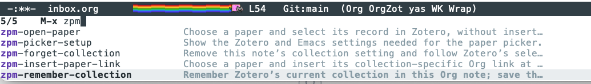

# ZPM quick start: Zotero links for Markdown and Org

Copy links to Zotero papers, PDFs, and collections into your notes. Choose
**Markdown** for Obsidian or another compatible Markdown editor, **Org** for
Emacs, or **Zotero URI** for a plain address. Emacs also has a searchable paper picker.

First, [install ZPM in Zotero](PLUGIN-QUICKSTART.md#1-install-zpm). Zotero 10 requires
ZPM 1.3.2 or newer. For Org links and the Emacs picker, also complete the
[Emacs setup on macOS](EMACS-SETUP.md).

## Copy a link into Markdown or Org

1. In Zotero's **My Library**, right-click a paper, PDF attachment, or collection.
2. Choose **ZPM → Copy Link → Markdown** or **Org**.
3. Paste into your note and open the link:
   - **Obsidian:** click it in Reading view. Other Markdown editors need support
     for opening `zotero://` links.
   - **Emacs Org:** put the cursor on the link and press **C-c C-o**
     (`org-open-at-point`).

For example, the same paper link has these two forms (the key is illustrative):

```markdown
[Paper title](zotero://select/library/items/ABCD2345)
```

```org
[[zotero-item:ABCD2345][Paper title]]
```

**A paper link selects its record; a PDF link opens its PDF.** For a PDF, expand
the paper and right-click its PDF row. Markdown copying needs no Emacs setup.

## Optional: find a paper from Emacs

1. **Choose a collection in Zotero.** Select one collection under **My Library**
   and leave Zotero running.
2. **Insert a link.** In your `.org` note, put the cursor where the link belongs.
   Run **M-x zpm-insert-paper-link**, type an author or words from the title,
   and press **Return** to choose a paper.
3. **Jump back to Zotero.** Place the cursor on the inserted link and press
   **C-c C-o** (`org-open-at-point`). Zotero selects that paper's record.

`M-x` means **Alt/Option-x**, or **Escape, then x**, depending on your keyboard
configuration. To cancel the picker, press **C-g**.

<details>
<summary>Emacs command reference and screenshot</summary>

Run these with **M-x**. Start with the first two:

| Command | Use it to… |
| --- | --- |
| **`zpm-insert-paper-link`** | Find a paper and insert its link into your note |
| **`zpm-open-paper`** | Find a paper and select its record in Zotero |
| `zpm-remember-collection` | Keep using one collection for this note; save the note afterward |
| `zpm-forget-collection` | Follow Zotero's current collection again; save the note afterward |
| `zpm-picker-setup` | Show setup help |



*Shown with Vertico completion. Your Emacs theme and completion list may look different.*

</details>

## A few useful details

- A note with a remembered collection uses that collection even when Zotero's
  selection changes. Otherwise, the picker follows the selected collection.
- The picker lists papers directly in the collection. To find a paper in a
  subcollection, select that subcollection. Group libraries are unsupported.
- These links open your local Zotero library; they do not share papers publicly.
- Exporting PDFs is a separate feature. Exports are one-way: edits to exported
  PDFs are not sent back to Zotero and may be overwritten on re-export.
  See the [plugin quick start](PLUGIN-QUICKSTART.md) for exports and settings.

Need more? See the [PDF, page, annotation, and multiple-link reference](LINKS.md),
[Emacs setup and connection help](EMACS-SETUP.md), or the
[Emacs paper picker reference](PAPER-PICKER.md).
